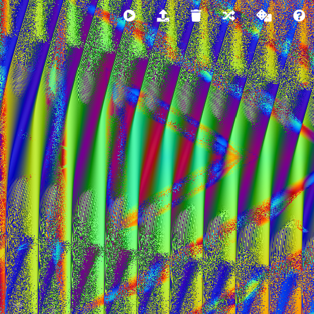

# Hydralisque

Fork of [Olivia Jack](https://github.com/ojack)'s
[Hydra](https://github.com/ojack/hydra) live coding environment.

## New features

* [x] Standalone version (no browser, no Atom).
* [x] No more annoying Ctrl-Left and Ctrl-Right key mappings.
* [x] TODO: easy MIDI controller setup
* [ ] TODO: expose video recorder
* [ ] TODO: show framerate
* [ ] TODO: simple timeline
* [ ] TODO: offline rendering
* [ ] TODO: hide toolbar
* [ ] TODO: edit code in separate window
